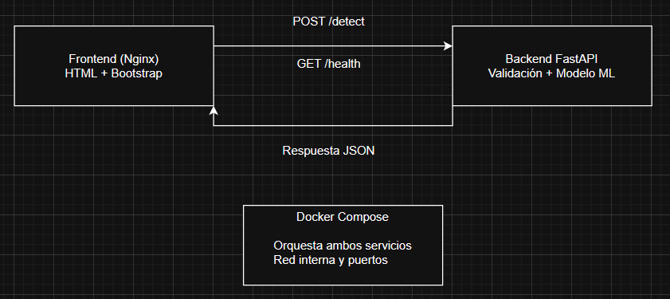

# Informe Final – Sistema de Reconocimiento de Actividad Humana (MHealth)

## 1. Resumen
Repositorio del proyecto: [https://github.com/Jvviers/ProyectoFinal_TallerIntegr](https://)
Este proyecto implementa una aplicación web completa para el reconocimiento de actividad humana basada en el dataset **MHealth (Mobile Health Dataset)**. El sistema permite cargar archivos `.log` reales provenientes de sensores corporales, procesarlos con un pipeline de validación robusto y obtener predicciones generadas por un modelo de Machine Learning entrenado previamente (RandomForest + StandardScaler encapsulados en un único `model_pipeline.pkl`).

La solución incluye:
- **Backend** desarrollado con FastAPI, encargado de la validación, preprocesamiento y predicción.
- **Frontend** implementado con HTML, CSS y Bootstrap, servido mediante Nginx.
- **Despliegue reproducible** mediante Docker Compose.
- **Validaciones exhaustivas** del archivo de entrada (separador, columnas, codificación, presencia de Label/Subject).
- **Interfaz comprensible para usuarios no técnicos**, con análisis estadístico básico y visualización clara del resultado.

El objetivo principal es cerrar el ciclo completo de Desarrollo de Ciencia de Datos: desde la adquisición y procesamiento del dataset en etapas previas del curso, hasta su integración en un sistema funcional y desplegable.

---

## 2. Contexto y relación con etapas previas del curso
Durante el semestre, se desarrollaron diversas etapas orientadas a comprender, procesar y modelar datos biométricos capturados desde sensores corporales. El dataset **MHealth** contiene señales provenientes de múltiples sensores ubicados en pecho, tobillo y brazo, distribuidos en 23 canales con una etiqueta por fila que indica la actividad realizada.

Las etapas previas incluyeron:

### **2.1. Adquisición y análisis exploratorio del dataset**
- Se descargaron archivos `.log` originales del dataset.
- Se exploró la estructura del archivo: 23 columnas de sensores + Label.
- Se detectaron variaciones en codificación, separadores y presencia o ausencia de columna `subject`.
- Se realizaron estadísticas descriptivas para comprender la distribución de actividades.

### **2.2. Preprocesamiento y limpieza**
- Normalización de datos con `StandardScaler`.
- Detección de valores atípicos.
- Validación de formatos.
- Remoción de columnas no utilizadas (Label y subject) antes del entrenamiento.

Estas decisiones influenciaron directamente el diseño del pipeline final usado en producción.

### **2.3. Entrenamiento y validación del modelo**
- Se entrenó un modelo **RandomForestClassifier** usando las 23 columnas de sensores.
- Se encapsuló el scaler y el modelo dentro de un único pipeline (`model_pipeline.pkl`).
- Se evaluó el rendimiento mediante métricas como accuracy, matriz de confusión y distribución de predicciones.

### **2.4. Transición hacia despliegue**
Esta etapa final integra todo lo anterior en un sistema ejecutable y reproducible:
- La lógica de preprocesamiento fue generalizada en funciones reutilizables.
- Se implementó un servidor HTTP para exponer el modelo como servicio.
- Se creó un frontend para interactuar con usuarios no técnicos.
- Se automatizó el despliegue mediante Docker.

---

## 3. Arquitectura General del Sistema

La arquitectura se divide en dos servicios principales: **backend** (FastAPI) y **frontend** (Nginx). Ambos se comunican a través de una red interna definida por Docker Compose.


### **3.1. Flujo del sistema**
1. El usuario selecciona un archivo `.log` real desde el navegador.
2. El frontend envía el archivo al backend mediante `POST /detect`.
3. El backend valida la estructura del archivo:
   - detecta separador
   - verifica número de columnas
   - identifica Label o Subject
   - maneja errores de codificación
4. Se construye un DataFrame con las 23 columnas esperadas.
5. El pipeline cargado desde `model_pipeline.pkl` escala y predice.
6. Se retorna:
   - clases numéricas
   - clases mapeadas a etiquetas
   - conteo por actividad
   - actividad predominante
   - metadatos del preprocesamiento
7. El frontend presenta resultados de forma estructurada.

### **3.2. Componentes**
- **Frontend:** interfaz estática accesible desde el navegador.
- **Backend:** servidor REST con FastAPI.
- **Pipeline:** funciones de preprocesamiento modular.
- **Modelo ML:** RandomForest + StandardScaler encapsulados.
- **Docker Compose:** orquestación y network.

---

## 4. Backend – Diseño e Implementación

### **4.1. Tecnologías utilizadas**
- **FastAPI**: por su rapidez, tipado fuerte, validaciones automáticas y documentación integrada.
- **Uvicorn**: servidor ASGI liviano y eficiente.
- **Pandas**: manipulación de DataFrames.
- **NumPy 1.23.5**: compatibilidad garantizada con `scikit-learn 1.0.2`.
- **Scikit-learn 1.0.2**: versión específica requerida para evitar incompatibilidades en el des-serializado (`joblib.load`).
- **python-multipart**: necesario para recibir archivos.

### **4.2. Endpoints expuestos**
#### **GET /health**
Indica que el backend está operativo.
```
{
  "status": "ok",
  "message": "backend listo"
}
```

#### **POST /detect**
Recibe un archivo `.log` y retorna:
- predicciones numéricas
- etiquetas interpretadas
- actividad dominante
- estadísticas del archivo
- metadatos del pipeline

### **4.3. Manejo seguro de errores**
Los errores se clasifican de la siguiente forma:
- **400 – Error del usuario:**
  - archivo vacío
  - separador inválido
  - número incorrecto de columnas
  - archivo mal codificado
- **500 – Error interno:**
  - errores inesperados
  - fallas en carga de modelo o pipeline

Esto garantiza mensajes claros y comprensibles para cualquier usuario.

---

## 5. Pipeline – Validación y Preprocesamiento

El pipeline implementado permite procesar casi cualquier variación del dataset MHealth original.

### **5.1. Validaciones implementadas**
- Detección inteligente del separador (`tab` o espacio).
- Verificación de columnas (23–24 columnas permitidas).
- Identificación automática de Label o Subject.
- Detección de archivos vacíos.
- Manejo de codificaciones mixtas (UTF-8 / Latin-1).

### **5.2. Compatibilidad con el modelo ML**
El archivo de entrada es transformado en un DataFrame con **las 23 features exactas** que el modelo espera.

### **5.3. Modelo encapsulado**
El archivo `model_pipeline.pkl` incluye:
- pipeline de Scikit-learn completo
- StandardScaler entrenado
- RandomForest entrenado
- orden de las features

Esto simplifica enormemente el backend, ya que no es necesario aplicar `scaler.transform` manualmente.

---

## 6. Frontend – UI para Usuarios No Técnicos

### **6.1. Tecnologías**
- HTML5
- Bootstrap 5
- JavaScript sin frameworks adicionales
- Nginx como servidor estático

### **6.2. Características principales**
- Botón selector de archivo `.log`.
- Spinner mientras se procesa.
- Alertas claras para errores.
- Vista detallada del preprocessing.
- Estadísticas por actividad.
- Actividad dominante destacada.
- JSON formateado y con scroll.

El frontend fue diseñado para maximizar claridad y simplicidad.

---

## 7. Despliegue – Docker Compose

### **7.1. Requisitos previos**
- Docker Engine >= 20
- Docker Compose v2
- Copiar `model_pipeline.pkl` en `backend/model/`

### **7.2. Ejecución**
```bash
docker-compose up --build
```

### **7.3. Servicios accesibles**
- Frontend: http://localhost:8080
- Backend docs: http://localhost:8000/docs

### **7.4. Verificación del despliegue**
```bash
curl http://localhost:8000/health
```

---

## 8. Pruebas – Casos de Éxito y Error

### **8.1. Caso exitoso – Archivo real MHealth**
Entrada: `subject1.log` (161280 filas)

Salida esperada:
- separador: `\t`
- columnas detectadas: 24
- última columna: Label
- actividad dominante: Downstairs

### **8.2. Caso exitoso – Archivo con separador espacio**
Salida esperada:
- detección automática del separador
- lectura correcta

### **8.3. Caso de error – Archivo vacío**
Respuesta:
```
400 – "El archivo está vacío o no contiene datos válidos"
```

### **8.4. Caso de error – Número incorrecto de columnas**
```
400 – "Se esperaban 23–24 columnas, se detectaron X"
```

### **8.5. Caso de error – Codificación inválida**
```
400 – "No fue posible decodificar el archivo en UTF-8 o Latin-1"
```

---

## 9. Resultados observados
Aplicando el modelo a distintos sujetos del dataset real se observaron:

- Predicciones coherentes con la distribución original.
- Consistencia entre actividades dominantes detectadas y etiquetas reales.
- Robustez ante variaciones menores en el formato.

Estos resultados muestran que el sistema final replica correctamente el comportamiento del modelo entrenado en etapas previas.

---

## 10. Reflexión – Despliegue en el Ciclo de Vida de Ciencia de Datos
Integrar un modelo funcional en un sistema desplegable permitió comprender:

### **10.1. Importancia del preprocesamiento consistente**
- Un modelo es inútil si los datos en producción no siguen el mismo pipeline que los datos de entrenamiento.
- Control de versiones de sklearn/numpy es crítico.

### **10.2. Robustez del sistema**
- Validar entradas reales evita errores en ejecución y mejora la experiencia del usuario.

### **10.3. Mantenibilidad y mejora futura**
- El sistema modular facilita actualización del modelo.
- Observabilidad (logs estructurados) sería un buen siguiente paso.

---

## 11. Mejoras futuras
- Añadir gráficos en frontend.
- Establecer límites de tamaño de archivo.
- Incorporar XAI (LIME/SHAP) para interpretar predicciones.
- Agregar CI/CD con tests automáticos.

---

## 12. Uso de IA Generativa
Se utilizaron herramientas de IA generativa para:
- Asistencia en estructuración del backend y pipeline.
- Depuración de código.
- Redacción técnica.

Los prompts utilizados se encuentran en la carpeta `prompts/`.

---

## 13. Referencias
- Dataset MHealth.
- Documentación de FastAPI.
- Scikit-learn: persistencia de modelos.
- Docker.

